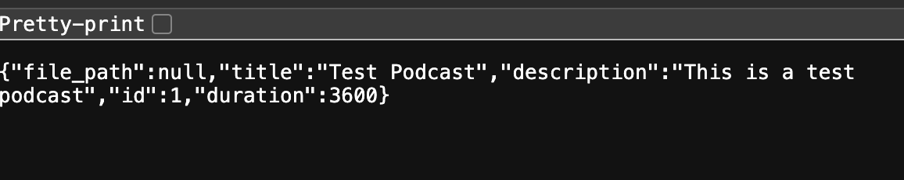
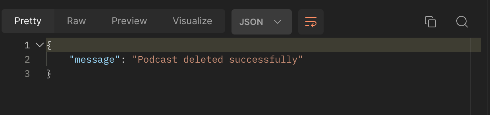

# fast-api-skillup

Creating a sample project to learn FastAPI with podcast theme

## Requirements:
* Install FastAPI \
  ```pip install fastapi```
* Install Uvicorn and sqlalchemy \
  ```pip install uvicorn sqlalchemy```
* Run the uvicorn server \
  ```uvicorn main:app --reload``` 

## Implementation:
Once the server is up, the routes can be tested using requests library or Postman.

1. **GET** request to get all the podcasts: \
   ```http://127.0.0.1:8000/podcasts/```
   Gives an empty list initially. \
    *Status*: \
    ```GET /podcasts/ HTTP/1.1" 200 OK```


2. **POST** request to add a podcast: \
   ```http://127.0.0.1:8000/podcasts/``` with body -
   ```
   {
    "title": "Test Podcast", 
    "description": "This is a test podcast",
    "file_path": "/path/to/podcast/file.mp3",
    "duration": 3600
    }
    #id is auto-generated
   ```
    *Status*: \
    ```POST /podcasts/ HTTP/1.1" 200 OK```

3. **GET** request to check posted podcast: \
   ```http://127.0.0.1:8000/podcasts/1``` \
    *Status*: \
    ```GET /podcasts/1 HTTP/1.1" 200 OK```
    

4. **DELETE** request to delete the podcast: \
   
   *Status*: \
    
